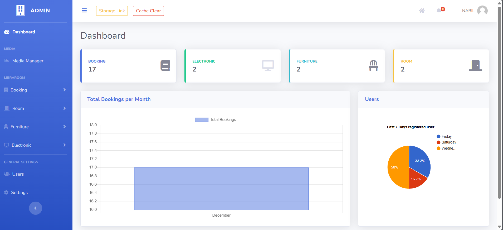
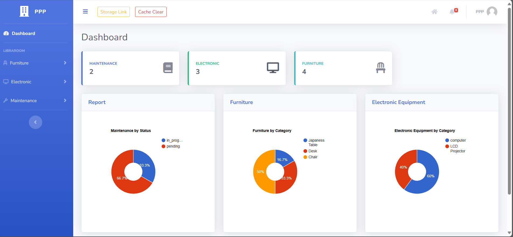
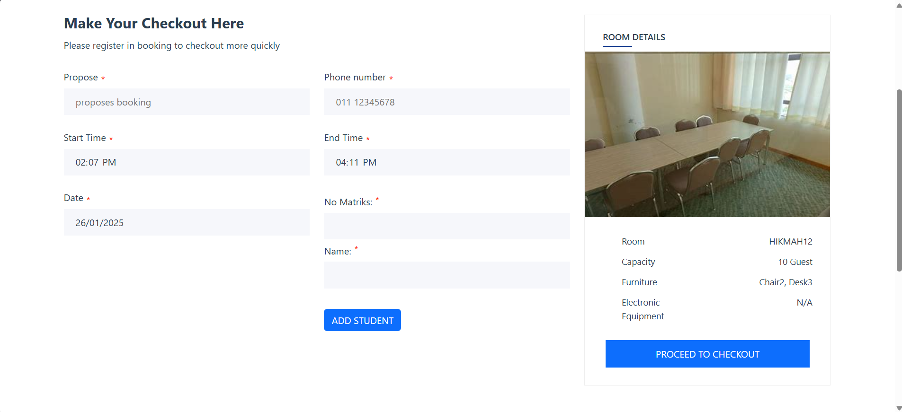
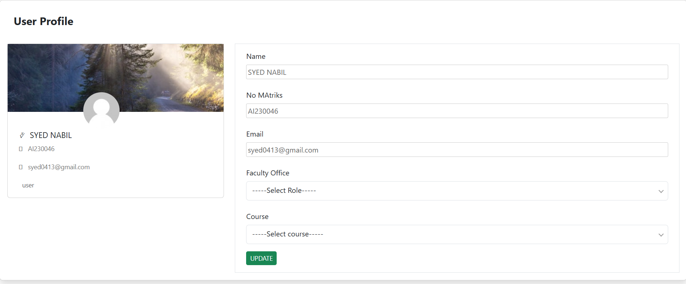
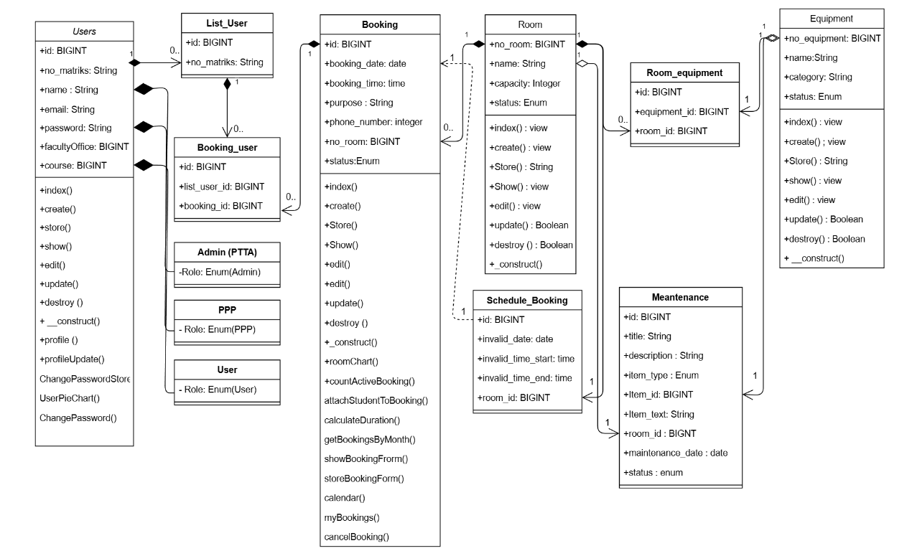
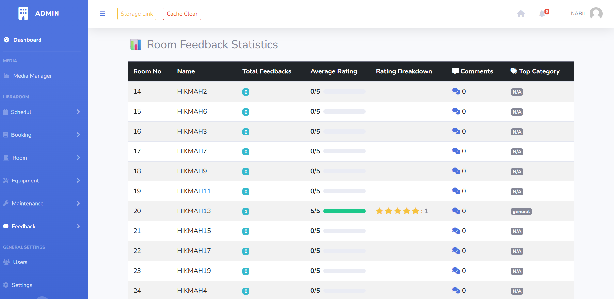

<div align="center">

# 🏫 PTTA-RESERVATION-SYSTEM  

_Empower Your Space – Effortlessly Reserve and Manage_

[](https://github.com/SNFASA/Hikmah-and-Ekplorasi-Room-Reservation-System/commits)  
  


---

## 🔧 Built With


</div>

---

## 📝 Overview

The **Room & Equipment Reservation System** is designed to streamline **room reservations, equipment bookings, maintenance scheduling, and feedback management**.  
It is tailored for academic institutions and organizations to manage resources efficiently.
---
### Demo website 
- .
- User can create new account to access the website 
- Admin page 
- username : nabil
- password : 1234
---

## 🔑 Features

### 👤 User Management
- CRUD operations for users (Create, Read, Update, Delete)  
- Password reset and role assignment  
- Faculty/office and course management  

### 🗓 Booking Management
- Create, update, and cancel room/equipment bookings  
- Attach users to bookings  
- Calendar view by month & purpose  
- Email reminders & admin notifications  

### 🏢 Room Management
- Add, edit, view, and delete rooms  
- Track capacity & availability  
- Link equipment to specific rooms  

### 🖥 Equipment Management
- Manage equipment lifecycle (CRUD)  
- Categorize & track usage status  

### 🛠 Maintenance
- Schedule maintenance sessions  
- Track progress & record maintenance logs  

### 💬 Feedback
- Booking users can submit feedback  
- Admin reviews feedback & reports  
- Automatic damage reports sent to maintenance  

### 📅 Reservation
- Similar to booking, but with extra admin features  
- Admin can add notes & update reservation status  
- Notifications for both users & admins  

### 📜 Activity Log
- Admin dashboard shows detailed system activity  

---

## 📊 Dashboards & Interfaces

### 🔹 Admin Dashboard  


### 🔹 PPP Staff Dashboard  


### 🔹 Home Page  
  

### 🔹 My Booking List  


### 🔹 Booking Checkout Form  


### 🔹 Reservation Checkout Form  


### 🔹 User Profile  


### 🔹 Feedback Page  


---

## 🗃 Database Design

### Key Entities:
1. **User** – name, email, role, faculty/office  
2. **Booking** – date, time, purpose, room  
3. **Room** – capacity, status, equipment associations  
4. **Equipment** – name, category, status  
5. **Schedule Booking** – blocked booking times  
6. **Maintenance** – logs and statuses  
7. **Reservation** – date, time, purpose, room  
8. **Log Activity** – record of admin/user actions  

📄 [View the EER Diagram](./doc/EERD%20librarRoom%20reservation%20system%20PDF.pdf)


---

## 🧱 Class Diagram (version 2)


---

## 🚀 Installation & Running  

```bash
# Clone the repository
git clone https://github.com/SNFASA/Hikmah-and-Ekplorasi-Room-Reservation-System

# Navigate into project folder
cd Hikmah-and-Ekplorasi-Room-Reservation-System

# Install PHP dependencies
composer install

# Install frontend dependencies
npm install

# Copy environment file & configure DB credentials
cp .env.example .env

# Generate Laravel app key
php artisan key:generate

# Run database migrations
php artisan migrate

# Start backend server
php -S localhost:8000 -t public

# Run frontend dev server
npm run dev

# Run backend tests
vendor/bin/phpunit

# Run frontend tests
npm test

website : http://pttareservation.lamanrasmi.com  
can create user 
admin :-
username : nabil@gmail.com
password : 1234
