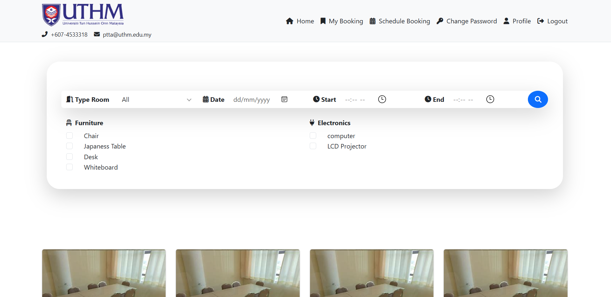

# Booking Management System

## Overview

The Booking Management System allows users to manage room and equipment bookings. It also facilitates user account management, maintenance scheduling, and booking records.

---

## Features

### User Management

- Create, view, edit, and delete user accounts.
- Change password functionality.
- User role and faculty/office assignment.
- Course management.

### Booking Management

- Create and manage bookings for rooms and equipment.
- Attach users to bookings.
- View bookings by month and purpose.
- Cancel bookings.

### Room Management

- Add, edit, view, and delete rooms.
- Track room capacity and status.
- Associate equipment with rooms.

### Equipment Management

- Add, edit, view, and delete equipment.
- Categorize equipment and track its status.

### Maintenance

- Schedule maintenance for rooms and equipment.
- Record maintenance details and track status.

 ### ADMIN DASHBOARD
  [ADMIN](/public./images/1.png)

### PPP STAFF DASHBOARD

### HOME PAGE 

### HOME PAGE 

### MY BOOKING LIST

### BOOKING FORM CHECK OUT

### PROFILE USER

---

## Database Design

The system is built around several key entities:

1. **User**

   - Includes attributes such as `name`, `email`, `role`, and `faculty/office`.
   - Relationship with `List_User` for further categorization.

2. **Booking**

   - Includes booking date, time, purpose, and associated room.
   - Relationship with `Booking_user` to link users to bookings.

3. **Room**

   - Includes attributes like `capacity` and `status`.
   - Linked with `Room_equipment` for equipment management.

4. **Equipment**

   - Includes attributes such as `name`, `category`, and `status`.

5. **Schedule Booking**

   - Tracks invalid booking times for rooms.

6. **Maintenance**

   - Tracks maintenance records for both rooms and equipment.

---

## Class Diagram

Below is the system's class diagram:

The diagram outlines the relationships and interactions between the system’s entities, controllers, and views.

---

## How to Use

### Setting Up the System

1. Clone the repository.
2. Import the database schema provided.
3. Configure the environment variables in the `.env` file.
4. Start the application server.

### Managing Users

1. Navigate to the User Management module.
2. Add, update, or delete user accounts.
3. Assign roles and faculties as needed.

### Creating Bookings

1. Go to the Booking module.
2. Fill in the booking details and select the associated room or equipment.
3. Save the booking.

### Viewing Reports

1. Access the Reports section.
2. View room or equipment usage, maintenance logs, or monthly bookings.

---

## License

This project is licensed under the MIT License.

---

## Contributions

Feel free to submit issues and pull requests to improve the system.

